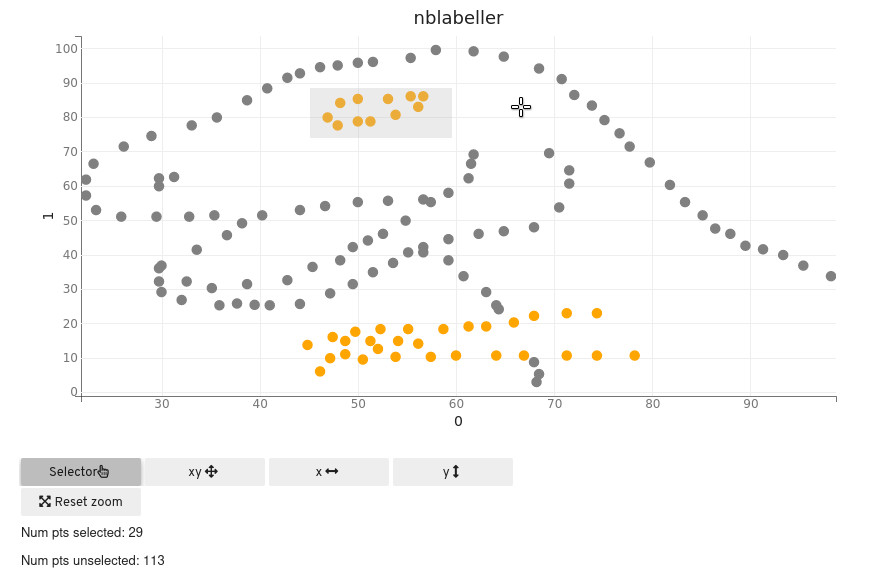

# nblabel

<!-- Purpose of project -->
<!-- Brief project description -->
Label tabular data directly in Jupyter Notebook / Lab.

## Description

<!-- Elaborate on brief description -->
Scratching my own itch to have a tabular data labelling tool that fits within the established data science workflow, without having to export data to a separate annotation tool. 

## Usage

Disclaimer: early WIP, currently looks like this:

```python
from nblabel import label

label(
    df, # The dataframe to use
    x_col="x", y_col="y", # Columns for x-axis and y-axis
    label_col_name="selected", # Column to store labels
    title="nblabeller" # Plot title
)
```



Use the selector tool for True / False annotations (more than enough for labelling anomaly detection datasets atm). Note that the selector tool is a toggle: selecting the same data point again will flip the label.

Save the `df` when you are done:

```python
df.to_csv("nblabel-example-output.csv")
```

_Data source: [Datasaurus](http://www.thefunctionalart.com/2016/08/download-datasaurus-never-trust-summary.html) by Alberto Cairo_ 

## Requirements

On top of packages that you probably already have: `pandas`, `numpy`, `traitlets` (comes with Jupyter), `nblabel` depends on `ipywidgets` and `bqplot`. 

1. Install `ipywidgets`, follow the installation instructions depending on which Jupyter you are using: https://ipywidgets.readthedocs.io/en/latest/user_install.html
2. `pip install git+https://github.com/tnwei/nblabel`

------------------

*Project based on the [cookiecutter-datascience-lite](https://github.com/tnwei/cookiecutter-datascience-lite/) template.*
